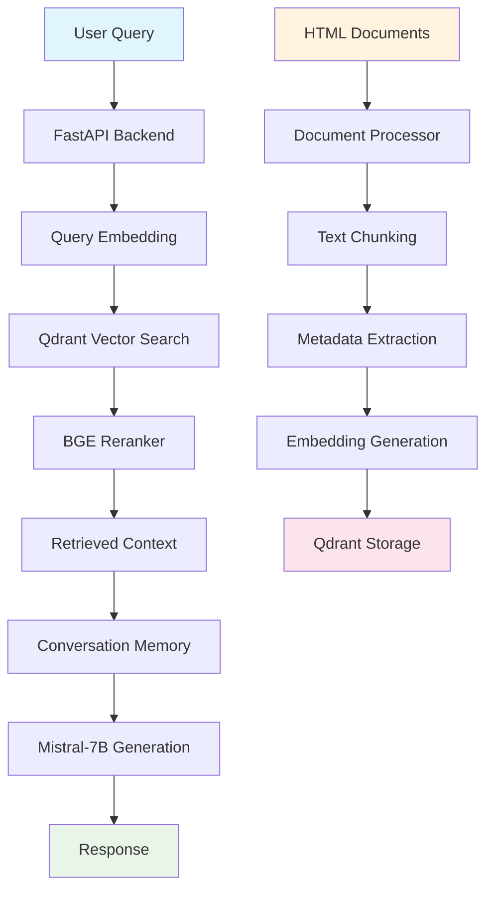

# 🌐 Multilingual RAG System for Industrial Process Documentation

[](https://python.org)
[](https://fastapi.tiangolo.com)
[](https://qdrant.tech)
[](https://ollama.ai)
[](LICENSE)
[](CONTRIBUTING.md)

A production-ready **Multilingual Retrieval-Augmented Generation (RAG)** system specifically designed for **Industrial Process Documentation**. This system provides intelligent, context-aware responses by combining advanced multilingual document processing, semantic search, and conversational AI for technical documentation across multiple languages.

## ✨ Key Features

### 🧠 **Advanced RAG Architecture**
- **Document Processing**: HTML document parsing with hierarchical section detection
- **Semantic Search**: Multilingual E5 embeddings with Qdrant vector database
- **Intelligent Retrieval**: BGE reranker for improved search relevance
- **Conversational AI**: Mistral-7B-Instruct with conversation memory
- **Fallback System**: Self-hosted Phi-3-mini model as backup

### 🔍 **Technical Capabilities**
- **Formula & Table Preservation**: Maintains technical content integrity
- **Metadata Extraction**: Equipment tags, technical terms, measurements
- **Multilingual Support**: Works across different languages
- **Real-time Processing**: Async operations for optimal performance
- **Production Ready**: Comprehensive logging, error handling, monitoring

### 💬 **Conversation Features**
- **Memory Management**: Remembers conversation context
- **Follow-up Questions**: Handles "What about section 3?" type queries
- **Session Management**: Multiple concurrent conversations
- **Context Awareness**: Understands document structure and relationships

## 🔒 Security & Privacy

> ⚠️ **IMPORTANT**: This repository contains only the code and sample data. **Enterprise documents are never committed** for privacy and security reasons.

### Privacy Protection
- **Enterprise documents are excluded** from the repository via `.gitignore`
- **Sample documents provided** for demonstration purposes
- **Configuration templates** use placeholder values
- **Sensitive data handling** follows enterprise security standards

### For Enterprise Use
1. **Clone the repository** (code only)
2. **Add your documents** to `data/documents/` (ignored by git)
3. **Process documents locally** using the provided scripts
4. **Deploy securely** with your processed data

See [SECURITY_GUIDE.md](SECURITY_GUIDE.md) for detailed security guidelines.

## 🛠️ Technology Stack

### Backend & API
- **[FastAPI](https://fastapi.tiangolo.com/)** - Modern, fast web framework for building APIs
- **[Uvicorn](https://www.uvicorn.org/)** - ASGI server for Python web applications
- **[Pydantic](https://pydantic-docs.helpmanual.io/)** - Data validation using Python type annotations

### AI & Machine Learning
- **[Mistral-7B-Instruct](https://huggingface.co/mistralai/Mistral-7B-Instruct-v0.1)** - Primary language model via Ollama
- **[Phi-3-mini-4k-instruct](https://huggingface.co/microsoft/Phi-3-mini-4k-instruct)** - Fallback self-hosted model
- **[Multilingual E5-large](https://huggingface.co/intfloat/multilingual-e5-large)** - Embedding model for semantic search
- **[BGE Reranker v2-m3](https://huggingface.co/BAAI/bge-reranker-v2-m3)** - Cross-encoder for result reranking

### Vector Database & Search
- **[Qdrant](https://qdrant.tech/)** - Vector similarity search engine
- **[Sentence Transformers](https://www.sbert.net/)** - Embedding generation framework

### Document Processing
- **[BeautifulSoup4](https://www.crummy.com/software/BeautifulSoup/)** - HTML parsing and processing
- **[Tiktoken](https://github.com/openai/tiktoken)** - Token counting and text chunking
- **[LangDetect](https://github.com/Mimino666/langdetect)** - Language detection

### Infrastructure & Deployment
- **[Docker](https://www.docker.com/)** - Containerization for Qdrant
- **[Ollama](https://ollama.ai/)** - Local LLM serving
- **[Python 3.8+](https://python.org/)** - Core programming language

## 🏗️ System Architecture



## 🚀 Quick Start

### Prerequisites

- **Python 3.8+**
- **Docker** (for Qdrant)
- **Ollama** (for Mistral model)
- **8GB+ RAM** (for model loading)

### Installation

#### Option 1: Automated Setup (Recommended)

1. **Clone the repository**
   ```bash
   git clone https://github.com/alaahazili/Multilingual-RAG-System-for-Industrial-Process-Documentation.git
   cd Multilingual-RAG-System-for-Industrial-Process-Documentation
   ```

2. **Run the setup script**
   ```bash
   python setup.py
   ```
   
   This will automatically:
   - Check system requirements
   - Create virtual environment
   - Install dependencies
   - Set up configuration files
   - Verify external services

3. **Start external services**
   ```bash
   # Start Qdrant Vector Database
   docker run -p 6333:6333 qdrant/qdrant
   
   # Install and start Ollama (from https://ollama.ai)
   ollama pull mistral:instruct
   ollama serve
   ```

4. **Process documents and start the application**
   ```bash
   # For demo: Process sample documents
   python scripts/process_html_document.py
   python scripts/create_embeddings.py
   
   # For enterprise use: Add your documents to data/documents/ first
   # (Your documents will be ignored by git for security)
   
   cd backend
   uvicorn app.main:app --host 0.0.0.0 --port 8000 --reload
   ```

#### Option 2: Manual Setup

1. **Clone the repository**
   ```bash
   git clone https://github.com/alaahazili/Multilingual-RAG-System-for-Industrial-Process-Documentation.git
   cd Multilingual-RAG-System-for-Industrial-Process-Documentation
   ```

2. **Create virtual environment**
   ```bash
   python -m venv venv
   # Windows
   venv\Scripts\activate
   # Linux/Mac
   source venv/bin/activate
   ```

3. **Install dependencies**
   ```bash
   pip install -r backend/requirements.txt
   ```

4. **Start Qdrant Vector Database**
   ```bash
   docker run -p 6333:6333 qdrant/qdrant
   ```

5. **Install and start Ollama with Mistral**
   ```bash
   # Install Ollama from https://ollama.ai
   ollama pull mistral:instruct
   ollama serve
   ```

6. **Process documents**
   ```bash
   # For demo: Process sample documents
   python scripts/process_html_document.py
   python scripts/create_embeddings.py
   
   # For enterprise use: Add your documents to data/documents/ first
   # (Your documents will be ignored by git for security)
   ```

7. **Start the application**
   ```bash
   cd backend
   uvicorn app.main:app --host 0.0.0.0 --port 8000 --reload
   ```

8. **Access the chatbot**
   - **Web Interface**: http://localhost:8000
   - **API Documentation**: http://localhost:8000/docs
   - **Health Check**: http://localhost:8000/api/health

## 📖 Usage Examples

### Web Interface
Simply visit http://localhost:8000 and start chatting with your PAC documents!

### API Usage

```python
import requests

# Basic chat
response = requests.post("http://localhost:8000/api/chat", json={
    "message": "What is the control philosophy for pressure regulation?",
    "session_id": "user_123"
})

print(response.json())
```

### Example Conversations

**Q**: "What is the pressure formula in section 1.6.1?"
**A**: "According to section 1.6.1, the pressure formula is P = ρgh + P₀, where ρ is fluid density, g is gravitational acceleration, h is height, and P₀ is atmospheric pressure. This formula is used for instantaneous pressure calculations in the slurry pipeline system."

**Q**: "And what about the flow control?"
**A**: "Flow control is covered in section 2.3. The system uses PID controllers with the following parameters: Kp=2.5, Ki=0.1, Kd=0.05. The flow rate is maintained within ±5% of the setpoint using feedback control from electromagnetic flow meters."

## 🔧 Configuration

### Environment Variables

Create a `.env` file in the project root:

```env
# API Configuration
API_HOST=0.0.0.0
API_PORT=8000

# Qdrant Vector Database
QDRANT_HOST=localhost
QDRANT_PORT=6333
QDRANT_COLLECTION=documents

# Model Configuration
MODEL_CACHE_DIR=models_cache
LOG_LEVEL=INFO
```

### Model Configuration

The system uses the following models:
- **Embedding**: `intfloat/multilingual-e5-large` (1024 dimensions)
- **Reranker**: `BAAI/bge-reranker-v2-m3`
- **Generation**: `mistral:instruct` (primary), `microsoft/Phi-3-mini-4k-instruct` (fallback)

## 📊 Performance Metrics

| Component | Performance | Notes |
|-----------|-------------|-------|
| **Document Processing** | ~2-5 seconds | HTML parsing and chunking |
| **Embedding Generation** | ~100ms per batch | Multilingual E5 model |
| **Vector Search** | ~50-200ms | Qdrant HNSW search |
| **Reranking** | ~100-300ms | BGE cross-encoder |
| **Text Generation** | ~2-5 seconds | Mistral-7B via Ollama |
| **Total Response Time** | ~3-6 seconds | End-to-end pipeline |

## 🧪 Testing

### Run Complete Tests
```bash
python scripts/test_complete_rag_architecture.py
```

### Individual Component Tests
```bash
# Test document processing
python scripts/process_html_document.py

# Test embeddings
python scripts/debug_embeddings.py

# Test Ollama integration
python scripts/test_ollama_integration.py
```

## 📁 Project Structure

```
chatbotHouri/
├── backend/                    # FastAPI application
│   ├── app/
│   │   ├── api/               # REST API endpoints
│   │   │   ├── chat_routes.py # Main chat interface
│   │   │   ├── health.py      # Health checks
│   │   │   └── ui.py          # Web interface
│   │   ├── core/              # Configuration
│   │   │   ├── settings.py    # Environment settings
│   │   │   └── logging.py     # Logging config
│   │   ├── services/          # Business logic
│   │   │   ├── data_layer/    # Document processing
│   │   │   ├── embedding_layer/ # Vector embeddings
│   │   │   ├── retrieval_layer/ # Search & retrieval
│   │   │   ├── generative_layer/ # LLM generation
│   │   │   └── conversation_layer.py # Memory management
│   │   └── main.py            # FastAPI app
│   └── requirements.txt       # Dependencies
├── data/                      # Data storage
│   ├── documents/            # Source HTML documents
│   └── processed_chunks.json # Processed document chunks
├── models_cache/             # Cached ML models
├── qdrant_db/               # Vector database storage
├── scripts/                 # Utility scripts
├── logs/                    # Application logs
└── static/                  # Web interface assets
```

## 🔍 API Documentation

### Core Endpoints

| Endpoint | Method | Description |
|----------|--------|-------------|
| `/api/chat` | POST | Main chat interface with conversation memory |
| `/api/health` | GET | System health and status |
| `/api/model-status` | GET | Model availability and configuration |
| `/` | GET | Web interface |

### Chat Request Format

```json
{
  "message": "Your question about PAC control philosophy",
  "session_id": "unique_session_identifier",
  "limit": 5
}
```

### Chat Response Format

```json
{
  "response": "Generated answer with technical details",
  "sources": [
    {
      "section": "1.6.1",
      "title": "Instantaneous Value Formulas",
      "content": "Relevant document excerpt..."
    }
  ],
  "session_id": "unique_session_identifier",
  "timestamp": "2024-01-01T12:00:00Z"
}
```

## 🚀 Production Deployment

### Docker Deployment

```dockerfile
FROM python:3.9-slim

WORKDIR /app
COPY backend/requirements.txt .
RUN pip install -r requirements.txt

COPY backend/ ./backend/
COPY data/ ./data/
COPY models_cache/ ./models_cache/

EXPOSE 8000
CMD ["uvicorn", "backend.app.main:app", "--host", "0.0.0.0", "--port", "8000"]
```

### Production Considerations

- **Resource Requirements**: 8GB+ RAM, 4+ CPU cores
- **Model Caching**: Models are cached locally for performance
- **Database Backup**: Regular Qdrant data backups
- **Monitoring**: Health checks and logging
- **Scaling**: Horizontal scaling with load balancer

## 🤝 Contributing

We welcome contributions! Please see our [Contributing Guidelines](CONTRIBUTING.md) for details.

1. Fork the repository
2. Create a feature branch (`git checkout -b feature/amazing-feature`)
3. Commit your changes (`git commit -m 'Add amazing feature'`)
4. Push to the branch (`git push origin feature/amazing-feature`)
5. Open a Pull Request

## 📝 License

This project is licensed under the MIT License - see the [LICENSE](LICENSE) file for details.

## 🆘 Support & Troubleshooting

### Common Issues

**Q: Models not loading**
- Ensure you have sufficient RAM (8GB+)
- Check Ollama is running: `ollama list`
- Verify model downloads: `ollama pull mistral:instruct`

**Q: Qdrant connection errors**
- Start Qdrant: `docker run -p 6333:6333 qdrant/qdrant`
- Check port availability: `netstat -an | grep 6333`

**Q: Slow response times**
- Preload models during startup (already implemented)
- Check system resources
- Monitor logs for bottlenecks

### Getting Help

- 📖 Check the [documentation](docs/)
- 🐛 Report issues on [GitHub Issues](https://github.com/yourusername/chatbotHouri/issues)
- 💬 Join our [Discussions](https://github.com/yourusername/chatbotHouri/discussions)
- 📧 Contact: your.email@example.com

## 🎯 Roadmap

- [ ] **Multi-document Support**: Process PDF, DOCX, and other formats
- [ ] **User Authentication**: Secure access and user management
- [ ] **Advanced Analytics**: Usage metrics and performance dashboards
- [ ] **API Rate Limiting**: Production-ready rate limiting
- [ ] **Caching Layer**: Redis integration for faster responses
- [ ] **Multi-language UI**: Internationalization support
- [ ] **Batch Processing**: Bulk document processing capabilities
- [ ] **Export Features**: Conversation and knowledge export

## 🙏 Acknowledgments

- **Qdrant** for the excellent vector database
- **Ollama** for easy local LLM deployment
- **Hugging Face** for the multilingual E5 embeddings
- **Microsoft** for the Phi-3 model
- **Mistral AI** for the instruction-tuned model

---

<div align="center">

**Built with ❤️ for Process Automation Control**

[⭐ Star this repo](https://github.com/yourusername/chatbotHouri) | [🐛 Report Bug](https://github.com/yourusername/chatbotHouri/issues) | [💡 Request Feature](https://github.com/yourusername/chatbotHouri/issues)

</div>